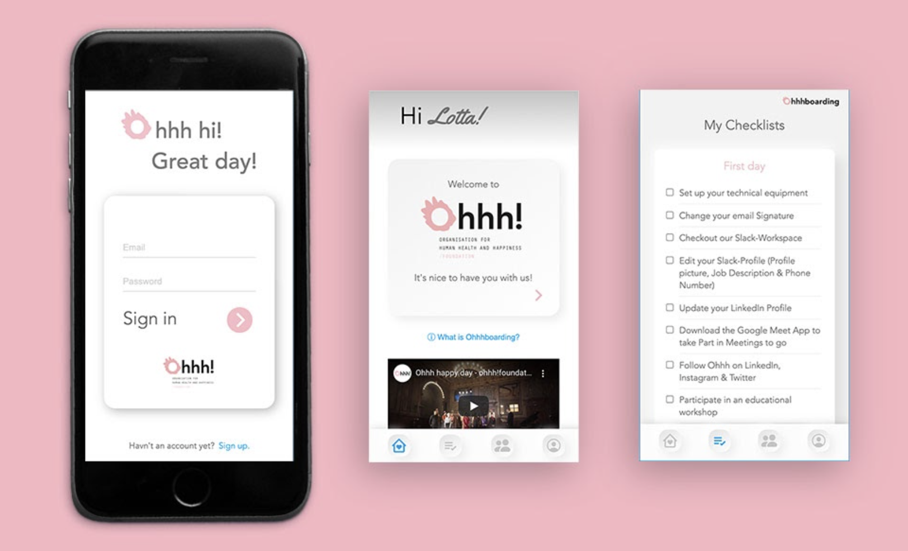

# capstone-project

## Design

## About Ohhhboarding
Did you know that an employee's first 100 days are considered crucial for successful job placements?

As the final project of my web development trainee at neuefische GmbH I developed an onboarding app - in cooperation with the Ohhh! Organisation for human health and happiness foundation

Ohhhboarding aims to positively influence the employee experience during the onboarding process, by combining HR and tech knowledge. It appeals to digital natives and can be used across sites.
